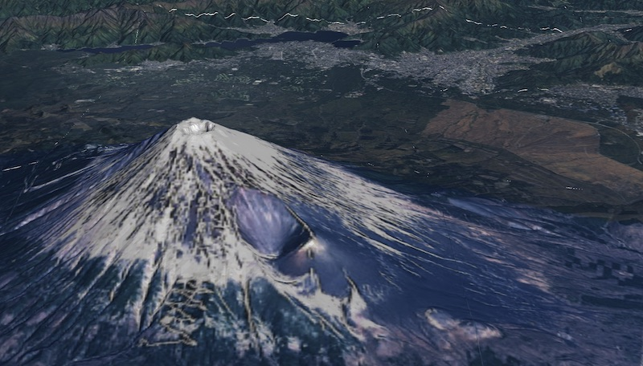

# deckgl-gsi-terrain-layer



国土地理院の標高タイルを用いて地形を3D表示するために、deck.glのTerrainLayerを標高タイルの独特な仕様に合わせて拡張したものです

RGB値の標高への換算(elevationDecoder)以外はTerrainLayerと全く同じ仕様です


## sample

以下のURLで地理院タイルのみを用いた3D表示のサンプルが見られます

https://kanahiro.github.io/deckgl-gsi-terrain-layer/


## usage

```shell

npm install deckgl-gsi-terrain-layer
```

```javascript

import { GsiTerrainLayer } from 'deckgl-gsi-terrain-layer';

// 地理院タイル
const TERRAIN_IMAGE = 'https://cyberjapandata.gsi.go.jp/xyz/dem_png/{z}/{x}/{y}.png';
const SURFACE_IMAGE = 'https://cyberjapandata.gsi.go.jp/xyz/seamlessphoto/{z}/{x}/{y}.jpg';

// RGB標高変換パラメータ
const ELEVATION_DECODER = {
    scaler: 0.01, // 分解能, 実寸なら0.01
    offset: 0, // RGB値がゼロの場合の標高値
};

const layer = new GsiTerrainLayer({
    id: 'gsiTerrain',
    minZoom: 0,
    maxZoom: 15,
    elevationDecoder: ELEVATION_DECODER,
    elevationData: TERRAIN_IMAGE,
    texture: SURFACE_IMAGE,
});

// あとは通常のTerrainLayerと同じ扱いです
```

<a href='./sample/src/components/GsiTerrainLayer.vue'>./sample/src/components/GsiTerrainLayer.vue</a>が実装例です


## Tips:elevationDecoder

### TerrainLayerの場合

deck.glオリジナルのTerrainLayerのelevationDecoderは以下のようなパラメータです

```javascript
elevationDecoder: {
    rScaler: 6553.6,
    gScaler: 25.6,
    bScaler: 0.1,
    offset: 0,
};
```

上記はRGBのそれぞれの値に対し、Red1当たりの標高値が6553.6m、Greenが25.6m、Blueが0.1mという事を意味します。

[※Mapboxなどで採用されているMapzen-Terrainの変換パラメータです](https://docs.mapbox.com/help/troubleshooting/access-elevation-data/)

### GsiTerrainLayerの場合

[国土地理院/標高タイル詳細仕様](https://maps.gsi.go.jp/development/demtile.html)から、無効値の定義などが独特であり、前述のTerrainLayerの様にRGB値で単調増加させればよいとは言えませんが、一部の特殊な値を除いては分解能0.01mでの単調増加です。

したがって、TerrainLayerで言うrScaler, gScaler, bScalerは固定値でよいため、本リポジトリで公開するGsiTerrainLayerでは、このパラメータを以下のように変更しています。

```javascript
elevationDecoder: {
    scaler: 0.01,
    offset: 0,
};
```

scalerは分解能を表します。実寸なら0.01ですが、強調表示したい場合、たとえば3倍にしたいなら0.03にすればよいです。